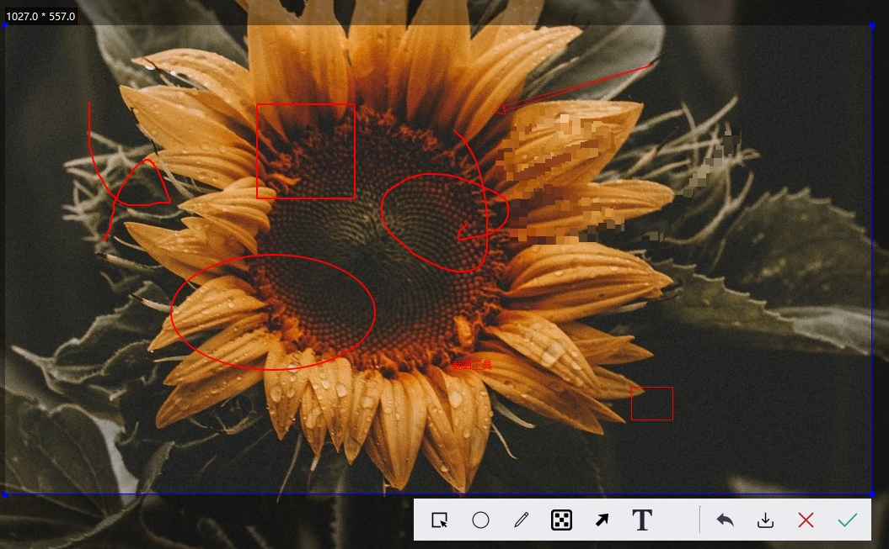
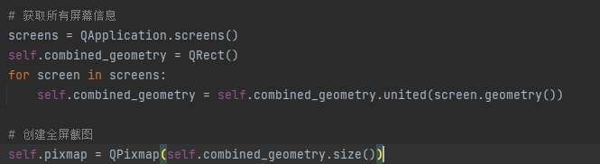

# PySide6 截屏小工具
**阅读其他语言版本: [English](readme_en.md).**

基于PySide6实现多屏幕截图功能

## 1. requirements

```
PySide6 >= 6.6.3
PySide6-Fluent-Widgets >= 1.6.3
```

## 2. 工具栏


### 2.1 图片编辑功能



## 3. 多屏幕截图功能



## 如果对你有帮助 请帮忙点个star

