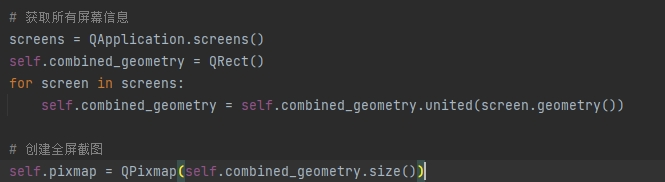

# PySide6 screenshot widget

Multi-screen capture function based on PySide6

## 1. requirements

```
PySide6 >= 6.6.3
PySide6-Fluent-Widgets >= 1.6.3
```

## 2. toolbar


### 2.1 Work picture editing function


## 3. Multi-screen capture function



## 4. Usage

```shell
python screenshot.py
```


## If it helps you, please click on star

